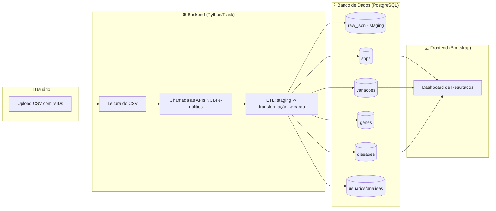
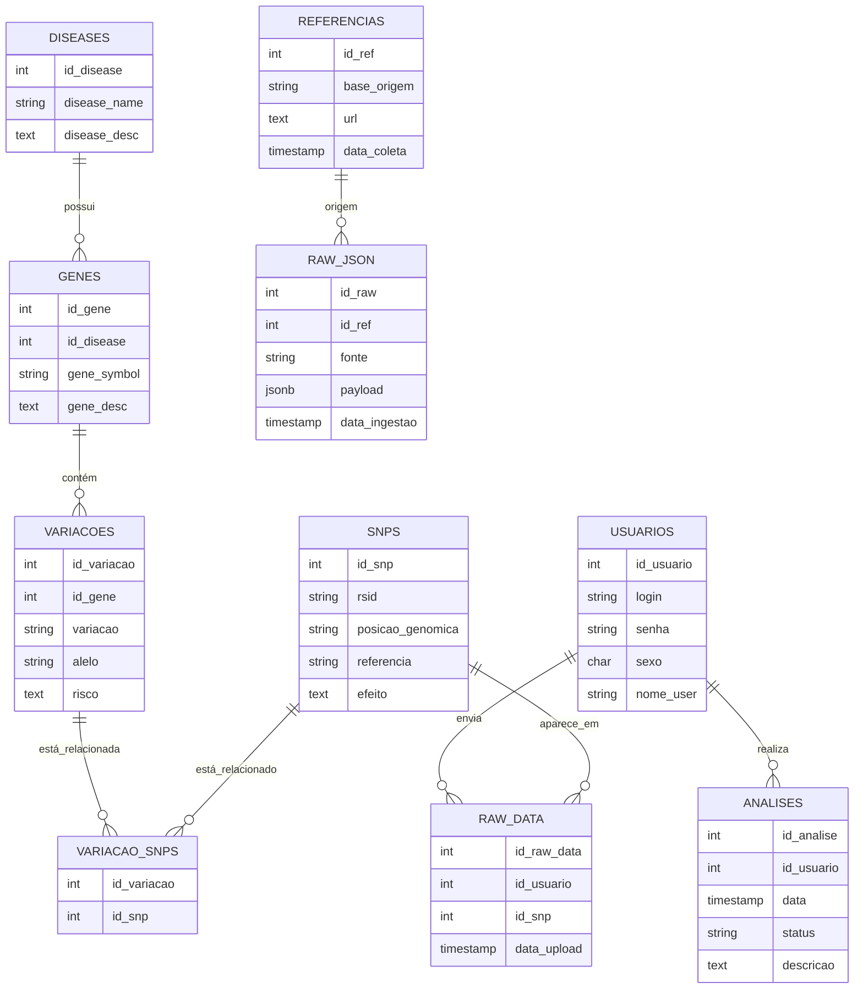

## Data Engineering Pipeline para Análise Genética

## Sobre o Projeto

Este projeto demonstra a construção de um **pipeline completo de engenharia de dados** aplicado à área da **genômica e saúde personalizada**.

A ideia é permitir que um usuário faça upload de um arquivo com seus **SNPs (rsIDs)** e, a partir daí:

1. Consultar APIs públicas do **NCBI (e-utilities)** para identificar **genes associados a doenças**.
2. Buscar **variações genéticas** relacionadas no **ClinVar**.
3. Obter detalhes de **SNPs no dbSNP**, incluindo riscos associados.
4. Estruturar todas as informações em um **banco de dados relacional (PostgreSQL)**.
5. Permitir ao usuário visualizar seus resultados via um **frontend simples (Bootstrap)**.

 O objetivo principal é **demonstrar competências sólidas em engenharia de dados**:

* Integração de múltiplas fontes externas.
* Criação de **pipeline ETL** com staging e transformação.
* Modelagem de **banco de dados relacional**.
* Rastreabilidade e boas práticas de logging.
* Documentação clara e orientada para **uso real em portfólio profissional**.

---

## Arquitetura (Visão Geral)

## Diagrama de Relacionamento DB

---

## Como Funciona na Prática

1. O usuário faz upload do seu **CSV** com identificadores de SNP (rsIDs).
2. O backend consome a API do **NCBI e-utilities** para buscar doenças, genes e variações associadas.
3. Os dados crus são armazenados em **staging (raw\_json)** para rastreabilidade.
4. Os dados transformados são organizados em tabelas normalizadas (`snps`, `variacoes`, `genes`, `diseases`).
5. O frontend exibe um **resumo personalizado**, como:

   * Doenças relacionadas ao usuário.
   * Genes impactados.
   * SNPs de maior risco.

---

## Melhorias Futuras (Nível Pleno → Avançado)

* Adicionar **Airflow/Prefect** para orquestração do pipeline.
* Exportar dados em **Parquet/JSON** simulando Data Lake.
* Implementar **testes unitários** para parsing das APIs.
* Containerização com **Docker** (Postgres + Backend).
* Criar caching de consultas às APIs do NCBI.
* Dashboard avançado (Gráficos + estatísticas por gene/doença).

---

Este repositório será atualizado à medida que cada tarefa for concluída.
Objetivo final: um projeto completo de **engenharia de dados aplicada à saúde**.

---

## Obstáculos Técnicos e Desafios Enfrentados

Durante o desenvolvimento do projeto **Genome Data Pipeline**, diversos desafios técnicos surgiram, exigindo adaptações criativas e decisões estratégicas. Abaixo estão os principais obstáculos enfrentados:

- **Limitações de APIs externas**  
  As APIs do NCBI (e-utilities) possuem restrições de taxa e estrutura de resposta complexa. Foi necessário implementar controle de tempo entre requisições e tratamento robusto de erros para garantir a estabilidade do pipeline.

- **Tradução de dados biomédicos**  
  A tradução automática das descrições de doenças (em inglês) para o português apresentou dificuldades. Bibliotecas como `googletrans` deixaram de funcionar em versões recentes do Python (como 3.13), e APIs como DeepL e Google Cloud Translate exigem planos pagos. A solução adotada foi realizar a tradução manual dos textos mais relevantes.

- **Limitações de bibliotecas em Python 3.13**  
  Algumas bibliotecas amplamente utilizadas, como `googletrans`, ainda não são compatíveis com Python 3.13 devido à remoção de módulos como `cgi`. Isso exigiu reavaliação de dependências e busca por alternativas compatíveis.

- **Documentação e visualização**  
  Traduzir a complexidade técnica do pipeline para uma documentação clara e acessível foi um desafio à parte. O objetivo foi tornar o projeto compreensível tanto para profissionais técnicos quanto para recrutadores e colegas de área.
